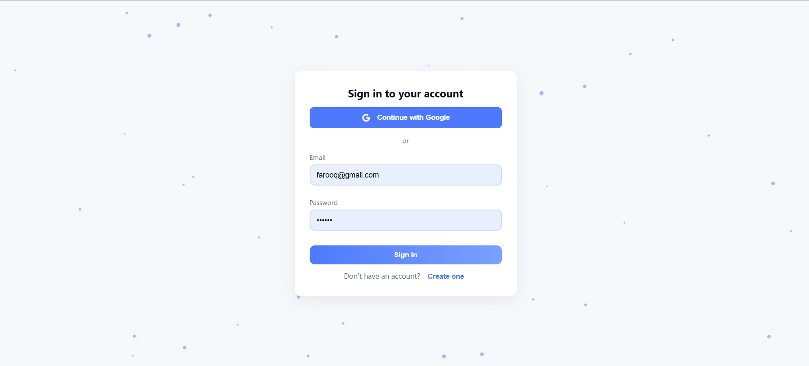
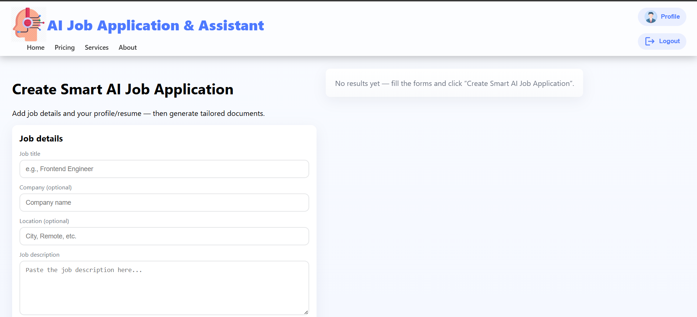
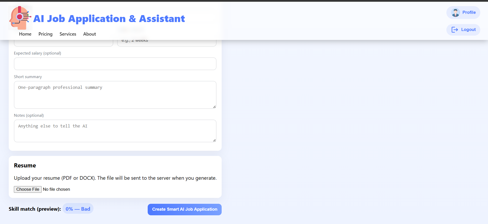
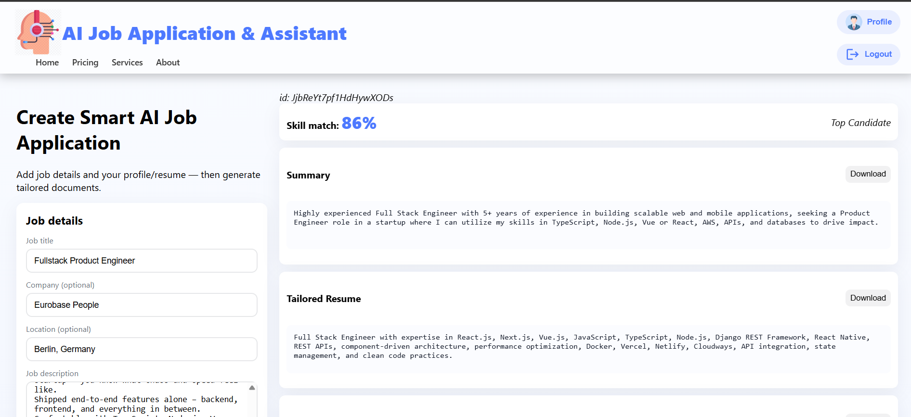
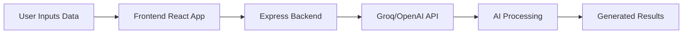

#  AI Job Application Assistant

<p align="center">
  <h3 align="center">An AI-powered platform for generating personalized job application materials</h3>

  <p align="center">
    Automatically create tailored resumes, cover letters, motivation letters, and job-fit analysis using AI.
  </p>
</p>

<p align="center">


</p>

---

##  Overview

The **AI Job Application Assistant** is an intelligent end-to-end platform designed to simplify and automate the job application process.

The system analyzes a job description alongside the candidate's profile and uses AI models to generate personalized application documents and evaluate how well the candidate matches the position.

Instead of manually adjusting resumes and writing cover letters repeatedly, users can generate optimized content within seconds.

---

#  Screenshots

> Create a folder called `screenshots` in your project root.

### Login



### AI Dashboard



### Prompt Area



### AI Generation Result



---

# 🎥 Live Demo

### Frontend

🔗 https://ai-job-application-assistant.netlify.app/login

---

#  Features

###  Smart Resume Generation

Generate customized resumes based on:

- Candidate profile
- Skills
- Experience
- Job requirements

---

###  Cover Letter Generation

Automatically generate:

- Professional cover letters
- Personalized content
- Company-specific wording

---

###  Motivation Letter Creation

Generate motivation letters tailored to:

- Company values
- Position requirements
- Candidate strengths

---

###  Skill Match Analysis

AI compares:

- Job requirements
- User skills
- Experience

Returns:

- Match percentage
- Missing skills
- Recommendations

---

###  Real-Time AI Processing

Powered by:

- Groq API
- LLaMA models
- OpenAI APIs

---

###  Modern Responsive Interface

Includes:

- Material UI
- Responsive design
- Clean user experience

---

#  How It Works



---

#  Project Structure

```bash
AI-Job-Application-Assistant/
│
├── frontend/
│   ├── src/
│   ├── public/
│   ├── package.json
│   └── ...
│
├── backend/
│   ├── index.js
│   ├── routes/
│   ├── controllers/
│   ├── package.json
│   └── ...
│
└── README.md
```

---

#  Local Setup

##  Clone Repository

```bash
git clone https://github.com/your-username/AI-Job-Application-Assistant.git

cd AI-Job-Application-Assistant
```

---

##  Backend Setup

```bash
cd backend

npm install
```

Create:

```env
.env
```

Add:

```env
PORT=5000


Run:

```bash
npm run dev
```

Backend:

```bash
http://localhost:5000
```

---

##  Frontend Setup

Open another terminal:

```bash
cd frontend

npm install

npm start
```

Frontend:

```bash
http://localhost:3000
```

---

# API Example

Request:

```json
POST /generate

{
  "jobDescription":"Frontend Engineer skilled in React",
  "userData":{
      "firstName":"John",
      "skills":"React,Node.js"
  }
}
```

Response:

```json
{
 "success":true,
 "data":{
     "resume":"...",
     "coverLetter":"...",
     "motivationLetter":"...",
     "skillMatch":87
 }
}
```

---

# Tech Stack

| Layer | Technology |
|---------|------------|
| Frontend | React |
| UI | Material UI |
| Backend | Node.js + Express |
| AI | Groq + OpenAI |
| Database | Firebase |
| Deployment | Netlify + Render |

---

# Scripts

| Command | Description |
|----------|-------------|
| npm start | Run frontend |
| npm run build | Production build |
| npm run dev | Run backend with nodemon |
| npm run server | Run backend |

---

# Future Improvements

- [ ] PDF export
- [ ] Firebase history storage
- [ ] Multiple templates
- [ ] Multi-language support
- [ ] AI fine tuning
- [ ] Authentication system

---

# Author

### Muhammad Farooq Alam Abbasi

Hybrid App & AI Developer

 LinkedIn: https://www.linkedin.com/in/muhammad-farooq-alam-abbasi-174616153/

 Portfolio: https://farooqalam.com

---

<p align="center">

Made with heart and AI

</p>